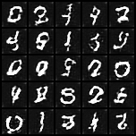
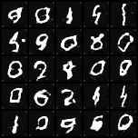
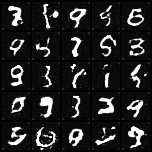
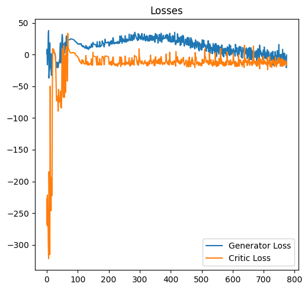

# 🧠 Digit Generation using WGAN-GP

This project implements a **Wasserstein GAN with Gradient Penalty (WGAN-GP)** to generate realistic handwritten digits from the MNIST dataset. WGAN-GP addresses several key issues of traditional GANs — such as mode collapse and training instability — by introducing a more principled loss function and enforcing a smoothness constraint through gradient penalty.

---

## 🎯 Objectives

- ✅ Implement a stable and robust GAN variant: **WGAN-GP**
- 🧠 Train on the MNIST dataset to generate synthetic digits
- 📉 Track training progress using **Wasserstein loss**
- 🖼 Apply **Gradient Penalty (GP)** to enforce the 1-L constraint on the critic
- 🔍 Visualize generated samples per epoch

---

## 🛠 Tech Stack

- **Frameworks**: PyTorch
- **Data**: MNIST (28x28 grayscale)
- **Core Concepts**: Generator, Critic, W-Loss, Gradient Penalty
- **Tools**: `tqdm`, `matplotlib` for tracking & visualization

---

## 📂 Project Structure

```
├── models/
│ └── generator.pth            # Trained generator weights
│ └── critic.pth               # Trained critic weights
├── WGAN_with_GP.ipynb         # Jupyter notebook with full code
├── generated_images/          # Output images from steps
├── generated_images.gif       # GIF with the Output images
├── requirements.txt           # Project dependencies
├── README.md                  # This file
```

---

## 📈 Results

- Smooth training curves using W-Loss
- No mode collapse
- Moderate-quality digit generation

---

## 🚀 How to Run

1. Clone the repo:
   ```bash
   git clone https://github.com/your-username/WGAN-GP-Digits.git
   cd WGAN-GP-Digits
   ```

2. Install dependencies:
   ```bash
   pip install -r requirements.txt
   ```

3. Launch the notebook:
   ```bash
   jupyter notebook WGAN_with_GP.ipynb
   ```

4. Or load the pretrained generator:
   ```python
   from load_generator import load_generator
   gen = load_generator()
   ```

---

## 📸 Sample Outputs

| Step 5000 | Step 10000 | Step 15000 |
|----------|----------|----------|
|  |  |  |

---

## 📉 Training Loss Curve



---

## 🧠 Why WGAN-GP?

> Traditional GANs suffer from vanishing gradients and unstable training. WGAN-GP introduces the **Wasserstein loss** and a **gradient penalty** to enforce a Lipschitz constraint, resulting in more stable and meaningful training.

---

## 📚 References

- [Wasserstein GAN with Gradient Penalty (arXiv)](https://arxiv.org/abs/1704.00028)
- [PyTorch Docs](https://pytorch.org/)
- [Build Better GANs (Coursera)](https://www.coursera.org/learn/build-better-generative-adversarial-networks-gans)

---

## 🏆 Author

Made with ❤️ by [Md. Ryhan Uddin](https://github.com/Ryhan9834)
